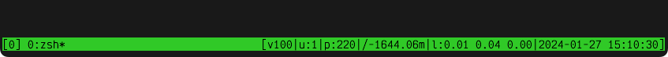
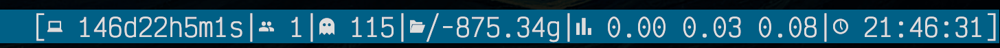

# ustat

A tiny little OS status display. It renders varios OS informations to STDOUT.
Its main purpose is to be used inside [tmux](tmux).

**ustat** could also be called µicroscopic … from which it derives its name, µstat.

How tiny is tiny? The statically linked binary on Linux is below 60kbyte on disk.

## Usage

ustat [-h] [mod1] [mod2] [...]

-h - show help (list of modules)

## Available modules

* %       - pass through
* nl      - newline
* load    - system load
* date    - date, strftime
* uid     - render user id
* user    - render user name
* nusers  - number of active users
* nproc   - number of processes
* ncpus   - number of cpus
* bat%    - battery level
* bat+h   - battery charging, human
* bat+    - battery charging
* memfh   - memory free, human
* memf    - memory free
* memr    - memory free, ratio
* memh    - memory total, human
* mem     - memory total
* fsth    - filesystem total, human
* fst     - filesystem total
* fsr     - filesystem ratio
* fsfh    - filesystem free, human
* fsf     - filesystem free
* fsuh    - filesystem used, human
* fsu     - filesystem used
* tcp6.e  - tcp6 established
* tcp6.l  - tcp6 listening
* tcp6.c  - tcp6 closing
* tcp6    - tcp6 total
* tcp4.e  - tcp4 established
* tcp4.l  - tcp4 listening
* tcp4.c  - tcp4 closing
* tcp4    - tcp4 total
* tcpdump - tcpdump
* tcp.e   - tcp established
* tcp.l   - tcp listening
* tcp.c   - tcp closing
* tcp     - tcp total
* coff    - color off
* 8#      - fg-color, normal
* 8*      - fg-color, bright
* B#      - bg-color, normal
* B*      - bg-color, bright
* 256#    - fg-color, 256colors
* 256*    - bg-color, 256colors
* rgb#    - fg-color, rgb
* rgb*    - bg-color, rgb

### Environment Variables

- USTAT_BAT_CHARGING - string to display "charging" (default: "^")
- USTAT_BAT_DISCHARGING - string to display "discharging" (default: "v")

## Usage within tmux

This config line for **tmux** will show the number of logged in users, the
number of processes, the free bytes on / (in human units), the load and the
datetime in the bottom right of **tmux**:

```tmux.conf

set -g status-right "[#(ustat 'u:' nusers '|p:' nprocs '|/-' fsfh '|l:' load '|' 'date%Y-%m-%d %H:%M:%S]')"

```

### Sample Session 1


It shows on the right side, from left to right:

* Battery is discharging ("v") (charging would be "^")
* Battery level is 100%
* Number of logged in users: 1
* Number of processes: 220
* Disk free on /: 1644mbyte
* Load is 0.01, 0.04 and 0.00 (see load(3))
* The date is 2024-01-27, 15:10:30 CET

### Sample Session 2


Visible:

* Uptime
* Number of logged in users
* Number of processes
* Disk free on /
* Load
* Time

Font: Victor Mono Nerd

## Compilation

General pre-requisite: You need a C compiler, GCC, CLANG, whatever.
I have tested **ustat** with GCC and CLANG. Others might work as well.

Fetch the source code:

    git clone https://github.com/mgumz/ustat
    cd ustat

### Linux

    make CFLAGS="-Wno-unused-result"


#### Small static Linux binaries

To get a small static binary:

1. Install https://www.fefe.de/dietlibc/
   (on Debian: `apt install dietlibc-dev`)

2. make ustat.diet

### MacOS

    make CFLAGS="-framework IOKit -framework CoreFoundation"

### FreeBSD

    make

### General

If you have CMAKE installed:

    mkdir build
    cd build
    cmake ..
    make

## License

See `LICENSE.md`.
